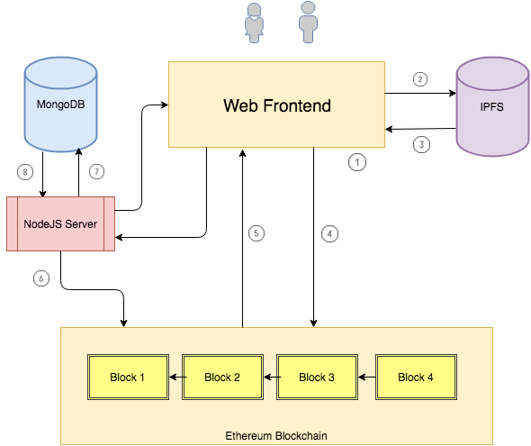

# 1，引言

## 1.1 欢迎

### 以太坊和 IPFS 上的去中心化 eBay

欢迎来到课程去中心化的 eBay。这是一个中级课程，你将会构建一个类似 eBay 的商场，卖家可以在这里拍卖售出他们的产品，买家也可以出价购买。

所有的商业逻辑和数据将会放在以太坊区块链上，这使得它是一个完全去中心化的应用。在以太坊上存储图片和大文本十分昂贵（由于 EVM 的限制，有时甚至是不可能）。为了解决这个问题，我们将会把图片和大文本存储在 IPFS(Inter Planetary File System)。在本课程中，我们将会学习更多有关 IPFS 的知识，并把它集成到应用中。

## 1.2 为什么要去中心化？

在开始构建我们的应用之前，非常值得花一分钟时间理解为什么要在像以太坊这样的去中心化平台上搭建一个商场。

eBay 已经获得了巨大成功，因为它使得买卖都相当便利。在互联网成为主流之前，人们只能在小范围内，或向邻居买卖商品。当越来越多的人使用互联网，出现了像 eBay 这样的公司，无论来自世界的任何一个地方，你都可以在网上买卖商品。无论是商家还是消费者，eBay 都是极好的。

尽管 eBay 方便了大家，也改善了贸易和经济，它也有一些缺点。

  - 1，参与的商家受制于公司。在任何时候，公司可以自行决定在它们的平台上对商家进行封号，而如果商家恰好依存于此，那么就是一个巨大的打击。

  - 2，商家陈列商品要交费，卖出商品也要交佣金。收费本身并没有错，毕竟 eBay 提供了服务。但是，陈列费有时太高了，这导致商家最后盈利很少，或是将成本转嫁到消费者身上。

  - 3，商家/消费者无法拥有自身数据。评论，购买历史等等所有数据都为公司所有。比如，如果一个商家想要换一个提供商，想要导出它原来的评论或是其他数据都非常不容易，或者几乎不可能。

在以太坊上构建商场就解决了这些问题。商家的账户不会被封，数据是公开的，所以很容易导出数据，相对于中心化公司，交易费也会低得多。

## 1.3 项目细节

现在你已经知道为什么以及我们要构建的应用是什么，让我们大致来看一下在这个项目中将要实现的所有功能：

  - 1，列出商品。商场应该能够让商家陈列商品。我们会实现让任何人免费陈列商品的功能。为了便于查询，我们会将数据同时存在链上和链下的数据库。

  - 2，将文件放到 IFPS： 我们会实现一个将图片和产品介绍（大文本）上传到 IPFS 的功能。

  - 3，浏览产品：我们会实现基于目录，拍卖时间等过滤和浏览商品的功能。

  - 4，拍卖：跟 eBay 一样，我们会实现 Vickery 拍卖对商品出价。与中心化应用不同，以太坊上的一切都是公开的，我们的实现将会有些不同。我们的实现将会类似于 ENS 的工作方式。

  - 5，托管合约（Escrow Contract）：一旦出价结束，商品有了赢家以后，我们会创建在买方，卖方和一个任意第三方的托管合约。

  - 6，2/3 签名：我们会加入防欺诈保护，方式为实现 2/3 多重签名，即三个参与者有两个同意才会将资金释放给卖方，或是将资金返还给买方。

## 1.4 先修课程

为了成功地完成课程，你应该对以下语言/技术有几本理解：

  - 1，Solidity：合约将会使用 solidity 编程语言。第一节课没有覆盖的内容(以太坊上的投票)都会这里深入合约时进行解释。如果你还没有完成第一节课，你必须至少写过一两个简单的 solidity 合约。对 truffle 有基本的了解将会十分有帮助。

  - 2，HTML/CSS: 相比投票课程，本课程将会有更多的 HTML 和 CSS 代码。你应该对使用 HTML/CSS 构建前端有基本的了解。

  - 3，Javascript: 我们将会进一步使用 JavaScript。它会在服务端将数据保存到数据库，查询数据库并将结果返回给前端。web3.js 用于前端与区块链交互。为了适用各种背景的学生，我们已经保持 JavaScript 代码尽可能地简单。

  - 4，Database: 在这节课，我们会用 MongoDB 在链下保存产品信息。无须特定了解 MongoDB ，但是基本的数据库知识还是必要的。

# 2，实现计划 

## 2.1 应用架构

在开始实现代码之前，先来看一下在本课程我们将要构建的 Dapp 的架构。

  - 1，Web 前端：web 前端由 HTML，CSS 和 JavaScript 组合而成（大量使用了 web3js）。用户将会通过这个前端应用于区块链，IPFS 和 NodeJS 服务器交互。

  - 2，区块链：这是应用的核心，所有的代码和交易都在链上。商店里的所有商品，用户的出价和托管合约都在链上。

  - 3，MongoDB：尽管产品存储在区块链上，但是通过查询区块链来显示产品，应用各种过滤（比如只显示某一类的产品，显示即将过期的产品等等）。我们会用 MongoDB 数据库来存储商品信息，并通过查询 MongoDB 来显示产品。

  - 4，NodeJS 服务器：这是后端服务器，前端通过它与区块链通信。我们会给前端暴露一些简单的 API 从数据库中查询和检索产品。

  - 5，IPFS: 当一个用户在商店里上架一个商品，前端会将产品文件和介绍上传到 IPFS，并将所上传文件的哈希存到链上。 
  
  架构图：
  
  

## 2.2 应用流程图

为了理解我们在上一节谈到的那些组件，让我们来看看一下用户上架一个商品的流程是怎样的。

- 1，当用户输入产品细节（名字，起价，图片，描述信息等等）并点击保存后，web 前端将会包含一个 HTML 表格。(1)

- 2，web 前端将产品图片和介绍上传到 IPFS，并返回这些所上传内容的链接。你可以在 这里 查看 IPFS 的链接示例。(2) 和 (3)

- 3，web 前端然后会调用合约将产品信息和 IPFS 链接存储到链上。当合约成功地将产品加入到区块链，就会触发一个事件。事件包含了所有的产品信息。(4)和(5)

- 4，NodeJS 服务器用来监听这些事件，当事件被合约触发时，服务器读取时间内容并将产品信息插入到 MongoDB。(6), (7) 和 (8)

流程图：



## 2.3 实现步骤

1，我们首先会用 solidity 和 truffle 框架实现合约，将合约部署到 ganache 并通过 truffle 控制台与合约进行交互。

2，然后我们会学习 IPFS，安装并通过命令行与它交互。

3，后端实现完成后，我们会构建前端与合约和 IPFS 进行交互。我们也会在前端实现出价和显示拍卖的功能。

4，我们会安装 MongoDB 并设计存储产品的数据结构。

5，一旦数据库启动运行，我们会实现 NodeJS 服务端代码，以监听合约事件，并记录向控制台的请求。我们然后会实现向数据库中插入产品的代码。

6，我们将会更新前端从数据库而不是从区块链查询产品。

7，我们会实现托管合约以及对应的前端，参与者可以从来向买方/买房释放或撤回资金。

# 3，以太坊合约

## 3.1，Truffle项目

要做的第一件事就是启动 truffle 项目。按照右侧指示创建 truffle 项目。

在接下来的几节，我们将会实现合约。下面是将要在合约中实现的几个用户场景：

1，用户应该能够将产品添加到区块链。我们首先会定义想要一个在链上存储的所有产品细节的结构。

2，实现将产品加入区块链的函数。

3，实现出价（bid）的功能，任何都可以对商品提交一个不公开的竞价。

4，实现证明出价金额的公开函数（reveal function）

```sh
$ mkdir ebay_dapp
$ cd ebay_dapp
$ truffle unbox webpack
$ rm contracts/ConvertLib.sol contracts/MetaCoin.sol
```

## 3.2，电子商务产品

>在 contracts 目录下创建一个新的文件，将右侧内容添加到里面。下面是合约细节。

### 存储产品和元数据的数据结构

1，struct Product: 当用户想要在商店列出一个商品时，他们必须要输入关于产品的所有细节。我们将所有的产品信息存储在一个 struct 里面。struct 里面的大部分元素都应当清晰明了。你应该能够注意到有两个元素 imageLink 和 descLink。除了在链上存储产品图片和大的描述文本，我们还会存储 IPFS 链接（下节会有更多介绍），当我们要渲染网页时，会从这些链接中获取这些细节。

2，enum: 很多编程语言都有枚举（enum）的概念。它是一个用户定义类型，可以被转换为整型。在我们的案例中，我们会将产品的条件和状态存储为枚举类型。所以，Open 的 ProductStatus 在链上存储为 0，已售出则为 1，如此类推。它也可以使得代码更加易读（相比于将 ProductStatus 声明为 0，1，2）

3，productIndex: 我们会给加入到商店的每个商品赋予一个 id。这就是一个计数器，每当一个商品加入到商店则加 1 。

4，productIdInStore: 这是一个 mapping，用于跟踪哪些商品在哪个商店。

5，stores mapping: 任何人都可以免费列出商店里的产品。我们通过 mapping 跟踪谁插入了商品。键位商家的账户地址，值为 productIndex 到 Product 结果的 mapping。

比如，现在商店还没有任何商品。账户地址为(0x64fcba11d3dce1e3f781e22ec2b61001d2c652e5) 的用户向店里添加了一个 iPhone，他想要卖掉这个 iPhone。我们的 stores mapping 现在就会是：0x64fcba11d3dce1e3f781e22ec2b61001d2c652e5 => {1 => "struct with iphone details"}

用 truffle compile 编译合约，在继续之前请确保没有任何问题。

>debug 合约里的问题可能非常麻烦。我们推荐每一节完成后都编译一下，以便于早发现，早治疗。

`EcommerceStore.sol`

```js
pragma solidity ^0.4.13;

contract EcommerceStore {
 enum ProductStatus { Open, Sold, Unsold }
 enum ProductCondition { New, Used }

 uint public productIndex;
 mapping (address => mapping(uint => Product)) stores;
 mapping (uint => address) productIdInStore;

 struct Product {
  uint id;
  string name;
  string category;
  string imageLink;
  string descLink;
  uint auctionStartTime;
  uint auctionEndTime;
  uint startPrice;
  address highestBidder;
  uint highestBid;
  uint secondHighestBid;
  uint totalBids;
  ProductStatus status;
  ProductCondition condition;
 }

 function EcommerceStore() public {
  productIndex = 0;
 }
}
```